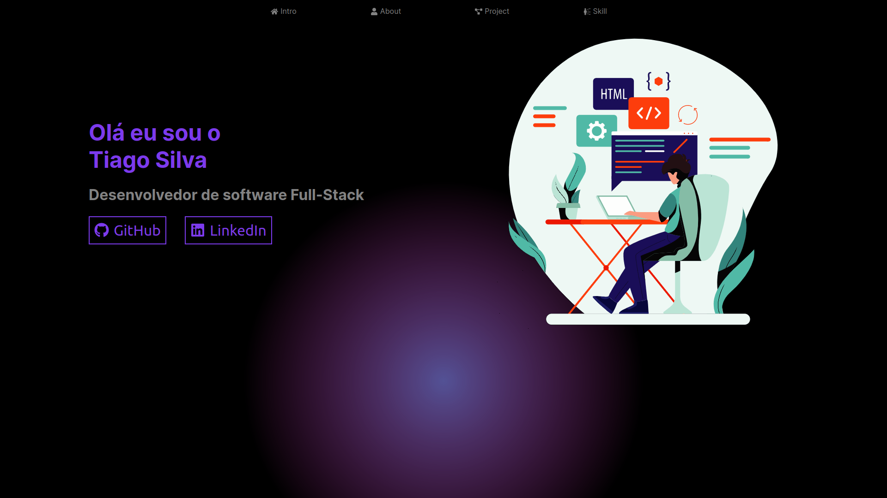

# Portfólio dos projetos e apresentação

## 🚀 Motivaçao / objetivo

Uma landing page online para minha apresentação e dos meus projetos.

<h1 align="center">
  
  
</h1>

## 💻 Requisitos

Antes de iniciar, você deve ter o Node.js e o YARN instalados em sua máquina.

## 🚀 Instalando

Primeiro, você deve clonar o projeto na sua máquina, para isso você
pode colar o seguinte comando em seu terminal

```bash
git https://github.com/Tiago-Silva/portfolio.git
```
Para instalar as dependências, execute o seguinte comando:

```bash
yarn install
```

Por fim, para executar o projeto basta rodar o seguinte:

```bash
yarn dev
```

## 🔧 Compilação

Para compilar a aplicação para produção, execute o seguinte comando:

```bash
yarn build
```
Isso irá gerar uma versão otimizada da aplicação na pasta `out`.

### Features

Tecnologias usadas nesse projeto:

<!-- Ícones de tecnologias. Você pode encontrar esses ícones em sites como https://simpleicons.org/ -->
<div style="display: inline_block"><br/>
  
  
  
  
  
  
  
  <!-- Adicione mais ícones de tecnologias que você utiliza -->
</div><br/>

## 📝 Licença

Este projeto está licenciado sob a licença MIT. Consulte o arquivo `LICENSE` para obter mais informações.
